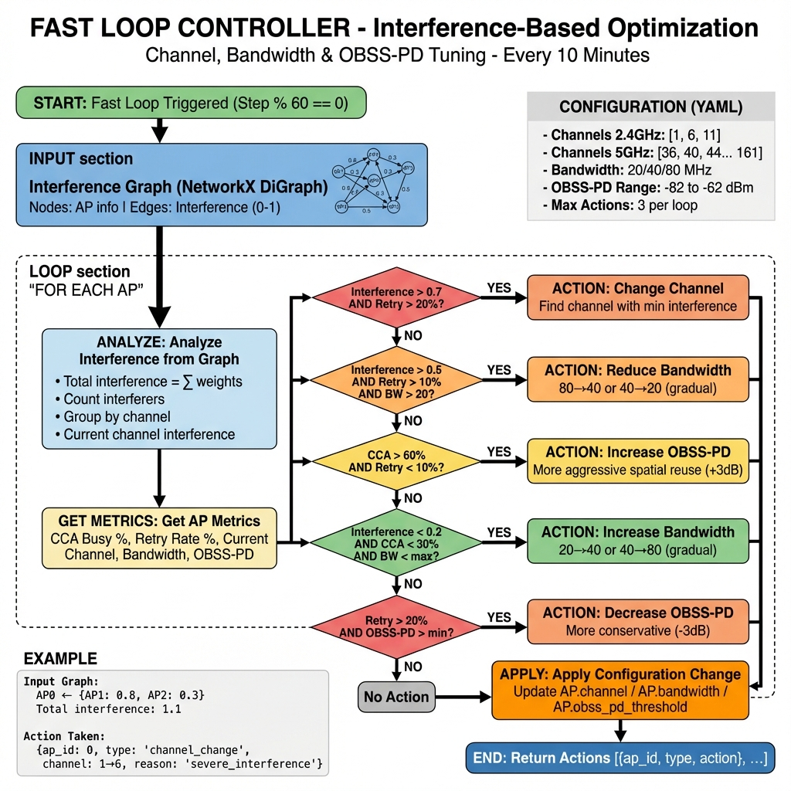

# Fast Loop Controller - Interference-Based Optimization

## Overview

The **Fast Loop Controller** performs **interference-based optimization** by analyzing the real-time interference graph to make reactive decisions about:

1. **Channel Changes** - Move to less congested channels
2. **Bandwidth Adjustments** - Reduce (80→40→20) or increase (20→40→80) gradually
3. **OBSS-PD Threshold Tuning** - Adjust spatial reuse aggressiveness

**Execution:** Every **10 minutes** (60 steps at 360 steps/hour)

---

## Architecture Diagram



---

## How It Works

### Input: Interference Graph

The Fast Loop receives a `NetworkX DiGraph` from the `InterferenceGraphBuilder`:

```python
# Graph structure
Nodes: {
    ap_id: {
        'channel': 36,
        'load': 0.6,
        'num_clients': 5,
        'x': 50, 'y': 50
    }
}

Edges: {
    (ap1_id, ap2_id): {
        'weight': 0.73,           # Normalized interference (0-1)
        'interference_dbm': -68.2, # Raw power in dBm
        'distance': 25.3          # meters
    }
}
```

**Edge weight formula:**
```
weight = channel_overlap × (0.5 × RSSI_norm + 0.2 × load_norm)
```

---

## Decision Algorithm

### Priority-Based Actions

The Fast Loop evaluates each AP using a **priority hierarchy**:

#### **Priority 1: Channel Change** (Highest Impact)

**Trigger:**
```python
if interference > 0.7 AND retry_rate > 20%:
    change_channel()
```

**Logic:**
1. Analyze interference per channel from graph
2. Find channel with minimum predicted interference
3. Require 30% improvement minimum
4. Change only if significantly better

**Example:**
```
Current: Channel 1, interference=1.1
Channels: {1: 1.1, 6: 0.2, 11: 0.4}
Action: Change to channel 6 (80% less interference)
```

---

#### **Priority 2: Bandwidth Reduction**

**Trigger:**
```python
if interference > 0.5 AND retry_rate > 10% AND bandwidth > 20:
    reduce_bandwidth()
```

**Logic:**
- **Gradual reduction:** 80 → 40 → 20 MHz
- Only one step per execution
- Avoid jumping (80 → 20 not allowed)

**Reason:** Narrower bandwidth = less channel overlap = less interference

---

#### **Priority 3: OBSS-PD Increase** (More Aggressive)

**Trigger:**
```python
if cca_busy > 60% AND retry_rate < 10%:
    increase_obss_pd()
```

**Logic:**
- High CCA but low retry = weak interferers
- Can ignore weaker signals → more spatial reuse
- Increase threshold: -82 → -79 → -76 dBm
- Step size: +3 dB
- Max: -62 dBm

**Effect:** AP ignores weaker signals, reduces CCA busy, increases capacity

---

#### **Priority 4: Bandwidth Increase** (Opportunistic)

**Trigger:**
```python
if interference < 0.2 AND cca_busy < 30% AND retry_rate < 5%:
    increase_bandwidth()
```

**Logic:**
- Clean spectrum detected
- **Gradual increase:** 20 → 40 → 80 MHz
- Constrained by band (2.4GHz limited to 20 MHz)

---

#### **Priority 5: OBSS-PD Decrease** (More Conservative)

**Trigger:**
```python
if retry_rate > 20%:
    decrease_obss_pd()
```

**Logic:**
- High collision rate = real interference
- Be more conservative
- Decrease threshold: -76 → -79 → -82 dBm
- Step size: -3 dB
- Min: -82 dBm

---

## Configuration (YAML)

### File: `fast_loop_config.yml`

```yaml
# Channel Options
channels:
  band_2ghz:
    available: [1, 6, 11]
    
  band_5ghz:
    available: [36, 40, 44, 48, 149, 153, 157, 161, 165]
    # DFS channels optional: [52, 56, 60, 64, ...]

# Bandwidth Management
bandwidth:
  options_5ghz: [20, 40, 80]
  max_increase_step: 1  # 20→40 or 40→80
  max_decrease_step: 1  # 80→40 or 40→20

# OBSS-PD Range
obss_pd:
  min_threshold: -82  # Most conservative
  max_threshold: -62  # Most aggressive
  step_size: 3

# Decision Thresholds
thresholds:
  interference:
    low: 0.2
    moderate: 0.5
    high: 0.7
  
  cca_busy:
    low: 0.3
    moderate: 0.6
    high: 0.8
  
  retry_rate:
    low: 5.0
    moderate: 10.0
    high: 20.0
```

---

## Example Scenarios

### Scenario 1: Severe Interference → Channel Change

**State:**
```
AP0: Channel 1, BW=20, OBSS-PD=-82
Interference from graph:
  ← AP1 (ch=1, weight=0.8)
  ← AP2 (ch=1, weight=0.3)
Total: 1.1 (HIGH)
Retry rate: 22%
```

**Fast Loop Analysis:**
```python
# Check Priority 1: Channel Change
interference (1.1) > 0.7 ✓
retry_rate (22%) > 20% ✓

# Find best channel
channel_interference = {1: 1.1, 6: 0.2, 11: 0.4}
best = 6 (0.2 interference)
improvement = (1.1 - 0.2) / 1.1 = 82% > 30% ✓

ACTION: Change AP0 to channel 6
```

**Result:**
```
AP0: Channel 6, BW=20, OBSS-PD=-82
New interference: 0.2 (LOW)
Expected: Retry rate ↓ to ~5%, throughput ↑
```

---

### Scenario 2: Moderate Interference → Bandwidth Reduction

**State:**
```
AP1: Channel 36, BW=80, OBSS-PD=-82
Interference: 0.6 (MODERATE)
Retry rate: 12%
```

**Fast Loop Analysis:**
```python
# Priority 1: Channel change? NO (interference not > 0.7)
# Priority 2: Bandwidth reduction?
interference (0.6) > 0.5 ✓
retry_rate (12%) > 10% ✓
bandwidth (80) > 20 ✓

# Reduce gradually
new_bw = 40  # 80 → 40

ACTION: Reduce AP1 bandwidth to 40 MHz
```

**Result:**
```
AP1: Channel 36, BW=40, OBSS-PD=-82
Expected: Less channel overlap, lower interference
```

---

### Scenario 3: High CCA, Low Retry → OBSS-PD Increase

**State:**
```
AP2: Channel 48, BW=40, OBSS-PD=-82
Interference: 0.4
CCA Busy: 68%
Retry rate: 6% (LOW despite high CCA)
```

**Fast Loop Analysis:**
```python
# Priorities 1-2: NO
# Priority 3: OBSS-PD increase?
cca_busy (68%) > 60% ✓
retry_rate (6%) < 10% ✓
obss_pd (-82) < -62 ✓

# Interpretation: High CCA from weak interferers
# Can afford to be more aggressive

new_obss_pd = -82 + 3 = -79 dBm

ACTION: Increase OBSS-PD to -79 dBm
```

**Result:**
```
AP2: Channel 48, BW=40, OBSS-PD=-79
Expected: CCA Busy ↓ (ignores weaker signals), capacity ↑
```

---

### Scenario 4: Clean Spectrum → Bandwidth Increase

**State:**
```
AP3: Channel 149, BW=20, OBSS-PD=-82
Interference: 0.1 (VERY LOW)
CCA Busy: 18%
Retry rate: 3%
```

**Fast Loop Analysis:**
```python
# Priorities 1-3: NO
# Priority 4: Bandwidth increase?
interference (0.1) < 0.2 ✓
cca_busy (18%) < 30% ✓
retry_rate (3%) < 5% ✓
bandwidth (20) < max (80) ✓

# Opportunity to increase capacity
new_bw = 40  # 20 → 40

ACTION: Increase AP3 bandwidth to 40 MHz
```

**Result:**
```
AP3: Channel 149, BW=40, OBSS-PD=-82
Expected: Higher throughput, better capacity
```

---

## Integration with RRM Engine

### Execution Flow

```python
def execute(self, step: int) -> Dict[str, Any]:
    # ... Event Loop, Cooldown, Slow Loop ...
    
    # Fast Loop (every 60 steps)
    if step - self.last_fast_loop_step >= 60:
        
        # 1. Build interference graph
        graph = self.graph_builder.build_graph(self.aps)
        
        # 2. Execute Fast Loop with graph
        actions = self.fast_loop_engine.execute(graph)
        
        # 3. Track results
        results['fast_loop_actions'] = actions
        results['fast_loop_stats'] = self.fast_loop_engine.get_statistics()
        
        self.last_fast_loop_step = step
    
    return results
```

### Output Format

```python
{
    'fast_loop_actions': [
        {
            'success': True,
            'ap_id': 0,
            'type': 'channel_change',
            'action': {'new_channel': 6},
            'reason': 'severe_interference'
        },
        {
            'success': True,
            'ap_id': 2,
            'type': 'obss_pd_increase',
            'action': {'new_obss_pd': -79},
            'reason': 'high_cca_low_retry'
        }
    ],
    'fast_loop_stats': {
        'channel_changes': 1,
        'bandwidth_changes': 0,
        'obss_pd_changes': 1,
        'total_actions': 2
    }
}
```

---

## Safety Mechanisms

### 1. Cooldown Between Actions

```yaml
safety:
  min_time_between_actions_same_ap: 60  # 10 minutes
```

Prevents thrashing (same AP changing too frequently).

### 2. Maximum Concurrent Actions

```yaml
safety:
  max_actions_per_loop: 3  # Change max 3 APs at once
```

Prevents network-wide disruptions.

### 3. Gradual Changes

- **Bandwidth:** Only one step (20→40 or 40→80)
- **OBSS-PD:** ±3 dB maximum per execution
- **Channel:** Smart selection based on interference

### 4. Minimum Improvement Thresholds

```yaml
min_improvement:
  channel_change: 0.3  # 30% less interference required
  bandwidth_change: 0.2
  obss_pd_change: 0.15
```

Prevents marginal/trivial changes.

---

## Tuning Guide

### For High-Density Networks

```yaml
thresholds:
  interference:
    high: 0.8  # More tolerant
  retry_rate:
    moderate: 15.0  # Higher bar
```

### For Low-Latency Applications

```yaml
thresholds:
  retry_rate:
    low: 3.0  # More aggressive
    moderate: 7.0
```

### For Spectrum-Constrained Environments

```yaml
channels:
  band_5ghz:
    available: [36, 40, 44, 48]  # Limit to non-DFS only
```

---

## Monitoring & Statistics

### Key Metrics

```python
stats = controller.get_statistics()
# {
#   'channel_changes': 12,
#   'bandwidth_changes': 8,
#   'obss_pd_changes': 15,
#   'total_actions': 35
# }
```

### What to Track

1. **Action Distribution**
   - Which action types are most common?
   - Too many channel changes? May need better initial planning

2. **Interference Trends**
   - Track interference before/after actions
   - Validate that actions reduce interference

3. **QoE Impact**
   - Monitor client QoE after Fast Loop actions
   - Should see improvement in retry rate, throughput

---

## API Reference

### FastLoopController

```python
class FastLoopController:
    def __init__(self,
                 config_engine: ConfigEngine,
                 policy_engine: PolicyEngine,
                 access_points: List[AccessPoint],
                 config_path: str = "fast_loop_config.yml")
    
    def execute(self, interference_graph: nx.DiGraph) -> List[Dict[str, Any]]
    
    def get_statistics(self) -> Dict[str, Any]
    
    def print_status(self)
```

### Return Format

```python
[
    {
        'success': bool,
        'ap_id': int,
        'type': str,  # 'channel_change', 'bandwidth_reduce', etc.
        'action': dict,  # {'new_channel': 6}, {'new_bandwidth': 40}, etc.
        'reason': str
    }
]
```

---

## References

- **Code:** `fast_loop_controller.py`
- **Config:** `fast_loop_config.yml`
- **Integration:** `enhanced_rrm_engine.py`
- **Graph Builder:** `metrics.py` → `InterferenceGraphBuilder`

---

**Version:** 2.0 (Interference-Based)  
**Last Updated:** 2025-12-04  
**Author:** RRM Team
